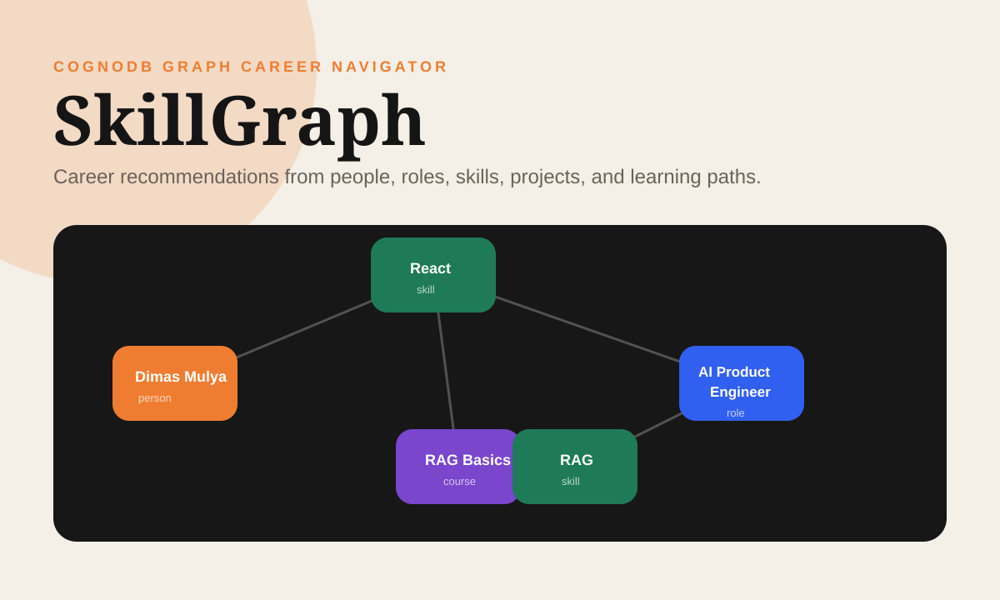
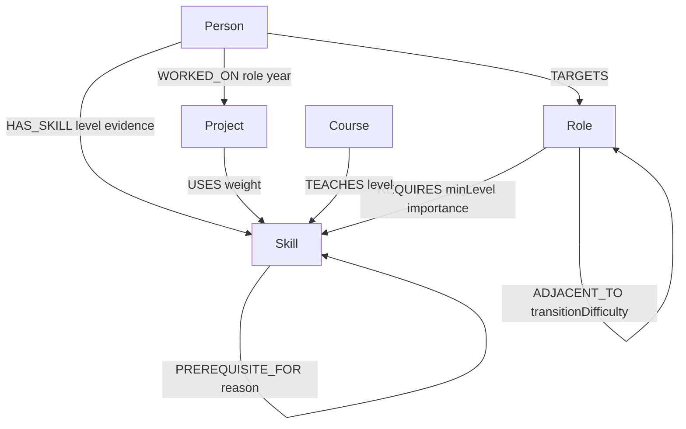

# SkillGraph Career Navigator

SkillGraph is a CognoDB-backed web application for exploring career transitions. It helps a non-technical user pick a candidate, choose a target role, see the candidate's skill gap, and follow graph-derived learning paths through prerequisites, courses, and relevant projects.

## Demo

- Hosted app: add your Vercel URL here after deployment.
- Screen recording: add your Loom/Drive URL here after recording.



## Why a graph database?

Career planning is mostly about relationships: a person has skills, roles require skills, courses teach skills, projects use skills, and some skills unlock other skills. A relational schema can store these facts, but the interesting questions quickly become recursive and join-heavy: "which skills can this candidate reach within three prerequisite steps?", "which projects expose mentors connected to missing skills?", and "which learning path bridges current ability to a target role?"

CognoDB earns its place because openCypher can express those traversals directly. Variable-length relationships such as `(:Skill)-[:PREREQUISITE_FOR*1..3]->(:Skill)` are easier to read, tune, and explain than multiple self-joins or application-side graph walking.

## Data Model



Node labels:

- `Person`: candidate profile, title, location, summary.
- `Role`: target career role, seniority, mission.
- `Skill`: reusable capability with category.
- `Course`: learning resource with provider, URL, and duration.
- `Project`: realistic work example with impact.

Relationship types:

- `HAS_SKILL`: person-to-skill with level and evidence.
- `REQUIRES`: role-to-skill with minimum level and importance.
- `TEACHES`: course-to-skill.
- `USES`: project-to-skill.
- `WORKED_ON`: person-to-project.
- `PREREQUISITE_FOR`: skill-to-skill dependency for multi-hop traversal.
- `TARGETS` and `ADJACENT_TO`: career intent and neighboring role movement.

## Main Queries

The application uses parameterized queries through the official `neo4j-driver`. The full query list is also in `cypher/main-queries.cypher`.

Skill gap query:

```cypher
MATCH (person:Person {id: $personId})
MATCH (role:Role {id: $roleId})-[requires:REQUIRES]->(skill:Skill)
OPTIONAL MATCH (person)-[has:HAS_SKILL]->(skill)
WITH skill, requires, has
WHERE has IS NULL OR has.level < requires.minLevel
RETURN skill, requires
ORDER BY requires.importance DESC, skill.name;
```

Multi-hop prerequisite query:

```cypher
MATCH (person:Person {id: $personId})
MATCH (role:Role {id: $roleId})-[requires:REQUIRES]->(missing:Skill)
OPTIONAL MATCH (person)-[has:HAS_SKILL]->(missing)
WITH person, missing, requires, has
WHERE has IS NULL OR has.level < requires.minLevel
OPTIONAL MATCH path = (known:Skill)-[:PREREQUISITE_FOR*1..3]->(missing)
WHERE (person)-[:HAS_SKILL]->(known)
WITH missing, path
ORDER BY length(path) ASC
RETURN missing.name AS targetSkill, collect(path)[0] AS shortestKnownPath;
```

This is the intentionally graph-shaped query. It finds a path from something the candidate already knows to a missing target skill across up to three prerequisite hops.

## Tech Stack

- Next.js App Router
- React and TypeScript
- CognoDB over Bolt protocol
- Official `neo4j-driver`
- CSS modules are not needed; global CSS keeps the small UI easy to review

## CognoDB Setup

1. Create a free CognoDB Cloud account at `https://console.cognodb.com`.
2. Create a new database instance.
3. Copy the Bolt URI, username, password, and database name.
4. Create `.env.local` from `.env.example`:

```bash
cp .env.example .env.local
```

5. Fill in the values:

```bash
COGNODB_URI=bolt+s://your-instance.cognodb.com:7687
COGNODB_USERNAME=neo4j
COGNODB_PASSWORD=your-password
COGNODB_DATABASE=neo4j
```

## Run Locally

```bash
npm install
npm run seed
npm run dev
```

Open `http://localhost:3000`.

If the database is unreachable, the app shows a clear warning and falls back to realistic demo data so the UX remains explorable. When the environment variables are set and the seed script has run, the same UI reads from CognoDB.

## Deploy

The fastest hosted demo path is Vercel.

1. Push this repository to GitHub.
2. Import the repo in Vercel.
3. Add `COGNODB_URI`, `COGNODB_USERNAME`, `COGNODB_PASSWORD`, and `COGNODB_DATABASE` in Vercel Project Settings.
4. Deploy.
5. Keep the CognoDB instance running until the assignment has been reviewed.

## Repository Structure

- `src/app`: Next.js pages, layout, global styles, and API route.
- `src/components`: interactive UI.
- `src/lib/neo4j.ts`: CognoDB/Neo4j driver setup from environment variables.
- `src/lib/queries.ts`: parameterized Cypher used by the app.
- `src/lib/seed-data.ts`: realistic seed dataset.
- `scripts/seed.ts`: data-loading script.
- `cypher/main-queries.cypher`: main queries for reviewers.
